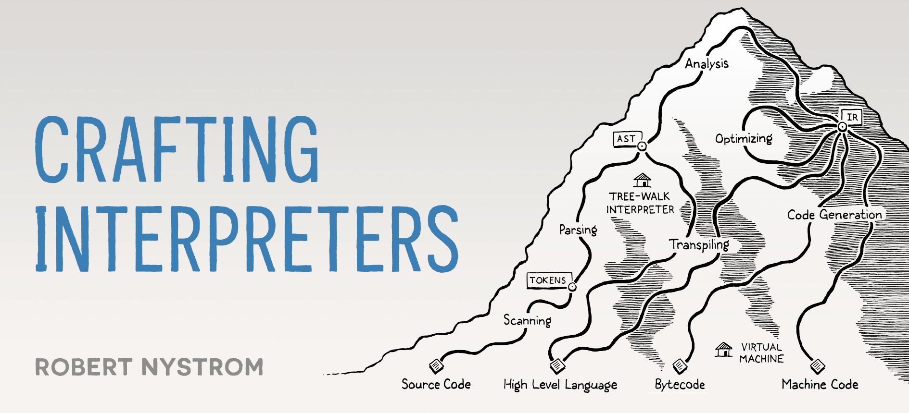

    

# Clox

Stack-based bytecode interpreter for the Lox language in C.

This is the second interpreter taught in
[Crafting Interpreters](https://craftinginterpreters.com/) by Robert Nystrom.

## Setup

See the [Makefile](./Makefile):

- `make` to compile the main executable (`clox`)
- `make run` to compile and run it
- `make clean` to clean the `build/` dir with all compilation artifacts
